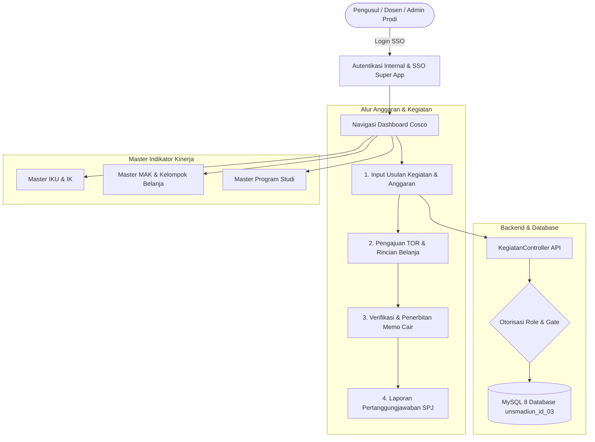

# 🏢 Super App Cost Control (Cosco) — UNS Madiun
## Universitas Sebelas Maret (UNS) Kampus Caruban / Madiun

[-FF2D20?style=flat&logo=laravel)](https://laravel.com/)
[-9553E9?style=flat&logo=inertia)](https://inertiajs.com/)
[](https://vitejs.dev/)
[](https://mysql.com/)
[](https://unsmadiun.id/)

---

## 1. 🏢 Ringkasan Eksekutif & Arsitektur Sistem

**Super App Cost Control (Cosco)** adalah platform manajemen perencanaan anggaran, pengajuan Term of Reference (TOR), pencairan dana (Memo Cair), dan pertanggungjawaban keuangan (SPJ) terintegrasi untuk seluruh unit dan Program Studi di lingkungan **Universitas Sebelas Maret (UNS) Kampus Madiun**.

Sistem dibangun menggunakan arsitektur modern **Monolithic Single-Page App (SPA) via Inertia.js**:
- **Frontend Layer**: React 19, TypeScript, Tailwind CSS v4, Lucide Icons, Radix UI, TanStack Query v5, dan Formik. Mengusung antarmuka **Executive Single-Layer** yang bersih, berwibawa, dan bebas dari *AI slop*.
- **Backend Layer**: Laravel 13 (PHP 8.3) RESTful & Inertia Controllers dengan proteksi otorisasi berbasis *Role & Privilege Gates*, database transaction integrity, serta middleware keamanan multi-tier.
- **Database Engine**: MySQL 8.0/8.4 (`unsmadiun_id_03`) dengan 19 tabel relasional terindeks InnoDB.



---

## 2. 👥 Matriks Hak Akses & Role Permissions (Cosco)

| # | Nama Role | Hak Akses Utama | Wewenang & Keterangan |
| :--- | :--- | :--- | :--- |
| **1** | **Pengusul / Dosen** | `kegiatan_add`, `tor_submit`, `spj_submit` | Menginput usulan kegiatan, mengunggah berkas TOR, dan mengunggah bukti SPJ. |
| **2** | **Verifikator Keuangan** | `memo_cair_create`, `spj_verify`, `kegiatan_verify` | Memverifikasi kelayakan anggaran MAK, menerbitkan Memo Cair, dan memvalidasi SPJ. |
| **3** | **Kepala Prodi (Kaprodi)** | `kegiatan_approve_prodi`, `monitoring_anggaran_prodi` | Menyetujui usulan kegiatan prodi dan memantau serapan anggaran. |
| **4** | **Admin Prodi** | `kegiatan_manage_prodi`, `data_sync` | Mengelola draft kegiatan dan administrasi keuangan tingkat program studi. |
| **5** | **Koordinator Kampus Madiun** | `all_privileges`, `pengaturan`, `user_manage` | **Full Administrator**; memantau serapan anggaran kampus secara menyeluruh. |

---

## 3. 🚀 Panduan Menjalankan Sistem Lokal

### Prasyarat:
- PHP >= 8.3 (Laragon / System PHP)
- MySQL >= 8.0 (Database: `unsmadiun_id_03`)
- Node.js >= 20.x & npm 10.x

### Langkah Menjalankan:
```bash
# 1. Pastikan database `unsmadiun_id_03` sudah terimport di MySQL
# 2. Masuk ke direktori laravel
cd laravel

# 3. Jalankan Server Lokal Laravel
php artisan serve --port=8000
```

---
© 2026 Universitas Sebelas Maret (UNS) Kampus Madiun. All Rights Reserved.
